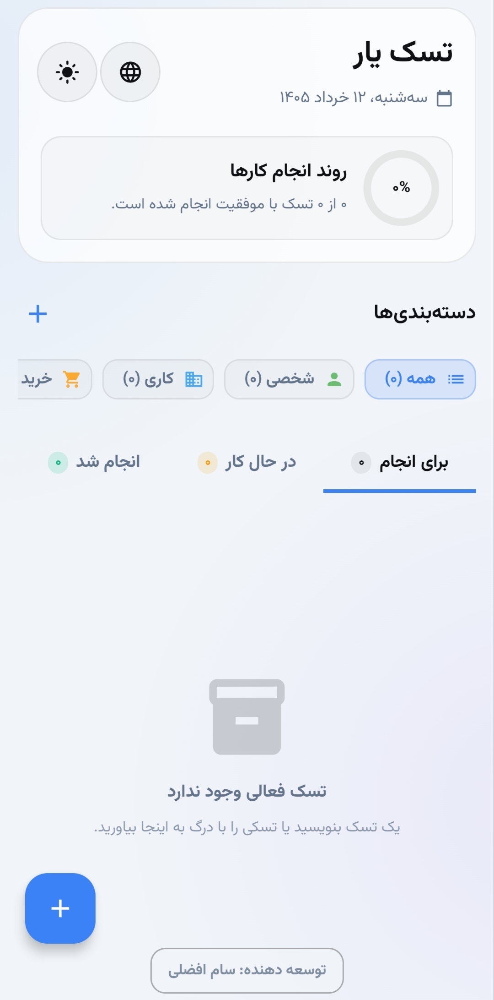
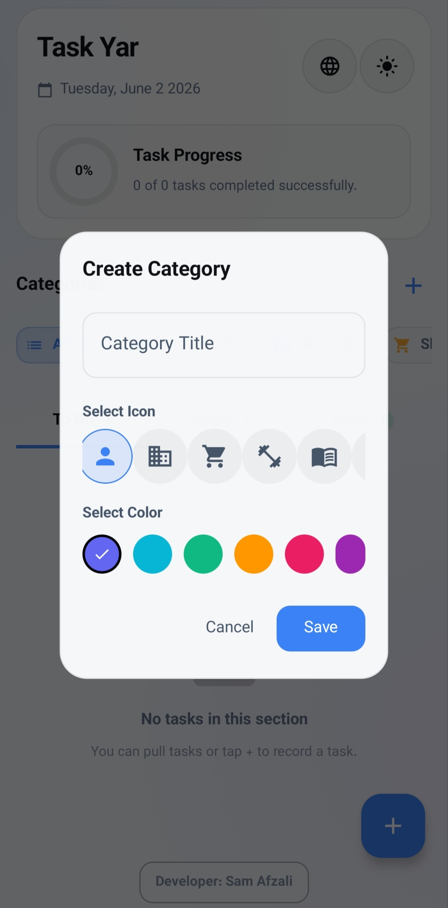
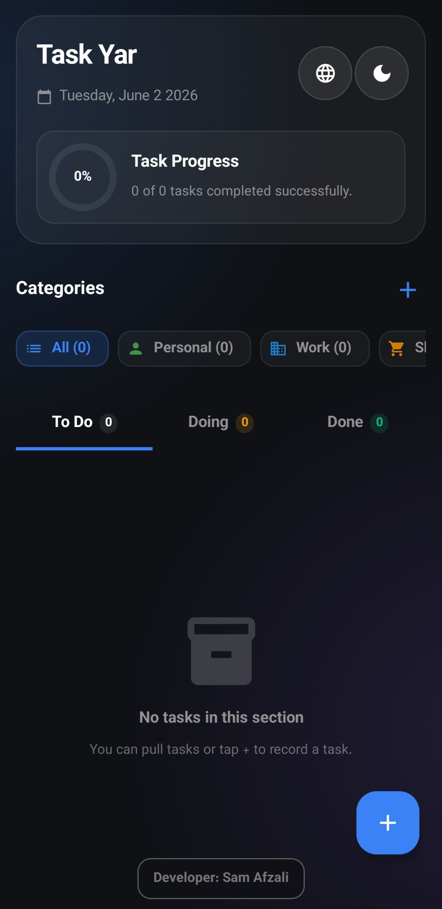

<div align="center">

# ✅ تسک یار (Task Yar)

### یک مدیر وظایف زیبا، مدرن و متن‌باز برای اندروید — ساخته‌شده با Kotlin، Jetpack Compose و Material 3

[](https://www.android.com/)
[](https://kotlinlang.org/)
[](https://developer.android.com/jetpack/compose)
[](https://m3.material.io/)
[](LICENSE)
[](#)
[](https://samafzali.ir)

**روزت رو برنامه‌ریزی کن. زندگی‌ت رو سامان بده. کارها رو انجام بده — زیبا، آفلاین و به زبان خودت.**

🇬🇧 [Read in English](README.md) · 🐛 [گزارش باگ](https://github.com/samafzalidev/task-yar/issues) · ✨ [درخواست ویژگی](https://github.com/samafzalidev/task-yar/issues)

</div>

---

## 📖 درباره‌ی پروژه

**تسک یار** یک اپلیکیشن مدیریت وظایف **متن‌باز، حرفه‌ای و سطح Premium** برای اندروید است که برای کسانی طراحی شده که می‌خواهند روزشان را به‌صورت **سریع، زیبا و بدون حواس‌پرتی** سامان دهند.

این اپ از پایه با **۱۰۰٪ کاتلین**، **Jetpack Compose** و **Material 3** ساخته شده و یک نمونه‌ی مدرن از توسعه‌ی اندروید مدرن است — شامل **معماری MVVM**، **پایگاه‌داده‌ی کاملاً آفلاین Room**، **پشتیبانی چندزبانه**، **تم تاریک/روشن**، **دسته‌بندی‌های سفارشی** و **مرتب‌سازی با Drag-and-Drop**.

> 💡 چه دانش‌آموز باشی و تکالیفت رو ردیابی کنی، چه برنامه‌نویس باشی و فیچرها رو مدیریت کنی، چه پدر/مادر مشغولی که می‌خوای کارهای خانه رو سامان بدی — تسک یار یک تجربه‌ی صیقل‌خورده و بومی به تو می‌ده، بدون تبلیغ، ردیابی یا نیاز به حساب کاربری.

---

## ✨ ویژگی‌های کلیدی

- ✅ **UI زیبای Material 3** — رنگ‌های پویا، شکل‌های مدرن، انیمیشن‌های نرم
- 🌗 **تم تاریک و روشن** — با تشخیص خودکار از تنظیمات سیستم
- 🌍 **پشتیبانی چندزبانه** — شامل پشتیبانی کامل فارسی و راست‌چین (RTL)
- 📂 **دسته‌بندی‌های سفارشی** — وظایف رو با رنگ و آیکن دلخواه دسته‌بندی کن
- 🖱️ **مرتب‌سازی Drag-and-Drop** — حرکات طبیعی و frame-perfect
- 💾 **۱۰۰٪ آفلاین** — اطلاعاتت روی دستگاه خودت می‌مونه (پایگاه‌داده Room)
- 🔐 **بدون حساب کاربری، بدون ردیابی، بدون تبلیغ** — حریم خصوصی کامل
- ⚡ **سرعت برق‌آسا** — رابط کاربری مبتنی بر Jetpack Compose با چیدمان لبه‌به‌لبه
- 🎯 **فیلتر و مرتب‌سازی هوشمند** — بر اساس تاریخ، اولویت، دسته یا وضعیت
- 🧠 **معماری MVVM + Clean** — کد سطح Production
- 🧪 **تست تصویری (Screenshot Test)** با Roborazzi برای جلوگیری از regression بصری
- 📱 **اندروید ۷.۰+ (API 24)** — اجرا روی ۹۸٪+ از دستگاه‌های اندروید فعال

---

## 📸 اسکرین‌شات‌ها

<div align="center">

| خانه | دسته‌بندی‌ها | حالت تاریک |
|:---:|:---:|:---:|
|  |  |  |

</div>

---

## 🛠️ تکنولوژی‌های استفاده‌شده

| لایه | تکنولوژی |
|---|---|
| 🎨 **UI** | Jetpack Compose · Material 3 · Compose Icons Extended |
| 🧠 **معماری** | MVVM · Single-Activity · Unidirectional Data Flow |
| 💾 **پایداری داده** | Room Database (با KSP) |
| 🌐 **شبکه** | Retrofit · Moshi · OkHttp Logging Interceptor |
| ⚡ **Async** | Kotlin Coroutines & Flow |
| 🔒 **Build** | Gradle Kotlin DSL · Secrets Gradle Plugin · Version Catalog |
| 🧪 **تست** | JUnit · Robolectric · Roborazzi · Espresso |
| 🔥 **اختیاری** | Firebase BOM (برای همگام‌سازی ابری آینده) |

---

## 🚀 شروع به کار

### 📋 پیش‌نیازها

- **Android Studio** نسخه‌ی Ladybug (2024.2.1) یا جدیدتر
- **JDK 17** یا بالاتر
- **Android SDK 36** نصب‌شده
- یک دستگاه واقعی یا شبیه‌ساز با **اندروید ۷.۰+ (API 24)**

### 📥 ساخت و اجرا

۱. **کلون کردن ریپازیتوری**
   ```bash
   git clone https://github.com/samafzalidev/task-yar.git
   cd task-yar
   ```

۲. **باز کردن پروژه** در Android Studio (File → Open → انتخاب پوشه)

۳. **همگام‌سازی Gradle** — اندروید استودیو خودکار dependencyها رو دانلود می‌کنه

۴. **اتصال دستگاه** (یا اجرای شبیه‌ساز) و کلیک روی ▶️ Run

   یا از طریق ترمینال:
   ```bash
   ./gradlew installDebug
   ```

### 🏗️ ساخت نسخه‌ی Release

برای ساخت APK نهایی امضاشده:

```bash
export KEYSTORE_PATH=/path/to/your/keystore.jks
export STORE_PASSWORD=your_store_password
export KEY_PASSWORD=your_key_password

./gradlew assembleRelease
```

APK امضاشده در مسیر `app/build/outputs/apk/release/` ساخته می‌شود.

---

## 📁 ساختار پروژه

```
task-yar/
├── 📁 app/
│   ├── build.gradle.kts
│   ├── proguard-rules.pro
│   └── src/main/
│       ├── 📄 AndroidManifest.xml
│       ├── 📁 java/com/example/
│       │   ├── MainActivity.kt
│       │   ├── 📁 data/         ← Entity ها، DAO ها و Repository ها
│       │   ├── 📁 ui/           ← صفحه‌های Compose و تم
│       │   └── 📁 viewmodel/    ← ViewModel های MVVM
│       └── 📁 res/              ← رشته‌ها، رنگ‌ها و آیکن‌ها
│
├── 📄 build.gradle.kts          ← اسکریپت Build اصلی
├── 📄 settings.gradle.kts
├── 📄 gradle.properties
├── 📄 metadata.json             ← متادیتای اپ
└── 📁 gradle/                   ← Version catalog و wrapper
```

---

## 🗺️ نقشه‌ی راه (Roadmap)

ویژگی‌های برنامه‌ریزی‌شده برای نسخه‌های آینده:

- [ ] 🔔 **یادآور و نوتیفیکیشن محلی**
- [ ] 📅 **وظایف تکرارشونده** (روزانه، هفتگی، سفارشی)
- [ ] ☁️ **همگام‌سازی ابری** از طریق Firebase / WebDAV / بک‌آپ به سبک iCloud
- [ ] 👥 **لیست‌های اشتراکی** برای خانواده/تیم
- [ ] 🎨 **تم‌ها و پالت‌های رنگ سفارشی**
- [ ] 📎 **پیوست فایل و تصویر** به وظایف
- [ ] 🗣️ **ورودی صوتی** برای افزودن سریع وظیفه
- [ ] ⌚ **اپ همراه Wear OS**
- [ ] 🧩 **ویجت صفحه‌ی خانگی** (با Compose Glance)
- [ ] 🤖 **پیشنهادهای هوشمند** با ML روی دستگاه

ایده داری؟ یک [Issue باز کن](https://github.com/samafzalidev/task-yar/issues) 🚀

---

## 🤝 مشارکت

مشارکت‌ها با آغوش باز پذیرفته می‌شوند! 🎉

۱. پروژه را Fork کن
۲. یک Branch جدید بساز (`git checkout -b feature/AmazingFeature`)
۳. تغییرات را Commit کن (`git commit -m 'feat: add AmazingFeature'`)
۴. روی Branch خودت Push کن (`git push origin feature/AmazingFeature`)
۵. یک Pull Request باز کن

> ⭐ اگر این پروژه برایت مفید بود، لطفاً یک **ستاره** بده — خیلی به انگیزه‌ام کمک می‌کنه!

---

## 📜 لایسنس

این پروژه تحت یک **لایسنس سفارشی و آزاد** منتشر شده است:

> © Copyright ۲۰۲۶ **سام افضلی (Sam Afzali)**
>
> اجازه‌ی استفاده، کپی و توزیع این نرم‌افزار برای مقاصد **شخصی، آموزشی و غیرتجاری** صادر می‌شود، به شرط ذکر نام نویسنده‌ی اصلی.
>
> **استفاده‌ی تجاری، تغییر، فروش مجدد یا ادعای مالکیت کد بدون اجازه‌ی کتبی صریح به‌شدت ممنوع است.**

📩 برای **لایسنس تجاری** یا **توسعه‌ی سفارشی**، با توسعه‌دهنده تماس بگیر (پایین).

برای جزئیات کامل، فایل [LICENSE](LICENSE) را مطالعه کن.

---

## 👨‍💻 توسعه‌دهنده

<div align="center">

### **سام افضلی (Sam Afzali)** — توسعه‌دهنده‌ی موبایل و فول‌استک

🌐 **وب‌سایت:** [samafzali.ir](https://samafzali.ir)
📧 **ایمیل:** [samafzalidev@gmail.com](mailto:samafzalidev@gmail.com) · [info@samafzali.ir](mailto:info@samafzali.ir)
🐙 **گیت‌هاب:** [@samafzalidev](https://github.com/samafzalidev)

_طراحی و توسعه با ❤️ از ایران_

</div>

> 💼 **آماده‌ی همکاری** — پذیرای پروژه‌های فریلنس اندروید، کاتلین و فول‌استک.

---

## 🙏 قدردانی

- [**Android Jetpack**](https://developer.android.com/jetpack) — جعبه‌ابزار مدرن اندروید
- [**Jetpack Compose**](https://developer.android.com/jetpack/compose) — آینده‌ی رابط کاربری اندروید
- [**Material 3**](https://m3.material.io/) — سیستم طراحی مدرن گوگل
- [**Room**](https://developer.android.com/training/data-storage/room) — پایگاه‌داده‌ای که فقط کار می‌کنه
- [**Roborazzi**](https://github.com/takahirom/roborazzi) — تست تصویری بدون درد
- تمام جامعه‌ی متن‌باز اندروید و کاتلین 💚

---

<div align="center">

**اگر تسک یار به سامان‌دادن روزت کمک کرد، یک ⭐ در گیت‌هاب فراموش نشه!**

ساخته‌شده با ❤️ توسط [سام افضلی](https://samafzali.ir)

</div>
